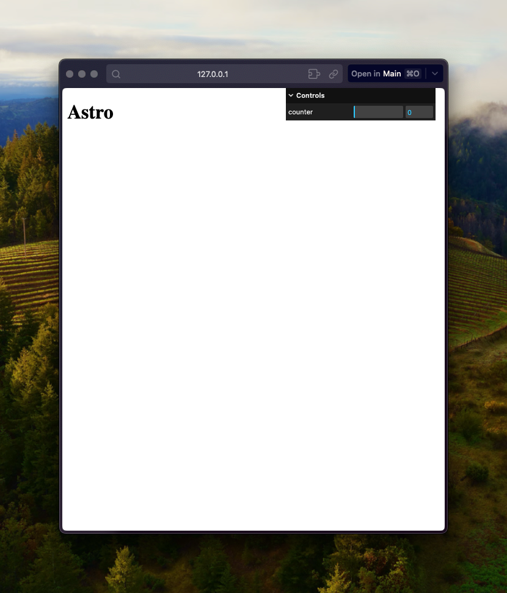

# Astro + lil-gui => build error



## Steps to repro

1. install deps: `pnpm i`;
1. run dev server: `pnpm run dev` (everything should be working);
1. stop dev server;
1. run a build: `pnpm run build`
1. see the error:
   ```
   error   The requested module 'lil-gui' does not provide an export named 'default'
   file:///Users/raulmelo/development/sandbox/test-lil-gui/dist/chunks/pages/script_d5fa1c97.mjs:1
   import GUI from 'lil-gui';
         ^^^
   SyntaxError: The requested module 'lil-gui' does not provide an export named 'default'
       at ModuleJob._instantiate (node:internal/modules/esm/module_job:124:21)
       at async ModuleJob.run (node:internal/modules/esm/module_job:190:5)
   ```

## Workaround

1. open `lil-gui` package.json (`node_modules/lil-gui/package.json`);
1. add the following:
   ```json
   "exports":{
       ".":{
       "import": "./dist/lil-gui.esm.js",
       "require": "./dist/lil-gui.umd.js"
       }
   },
   ```
1. run build again;
1. now everything will work
